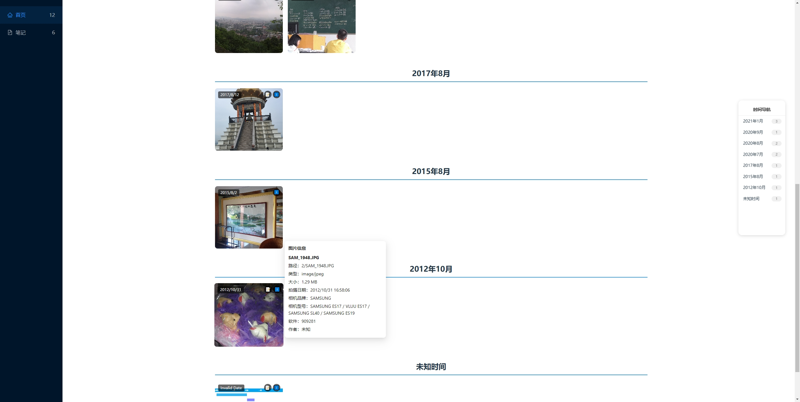
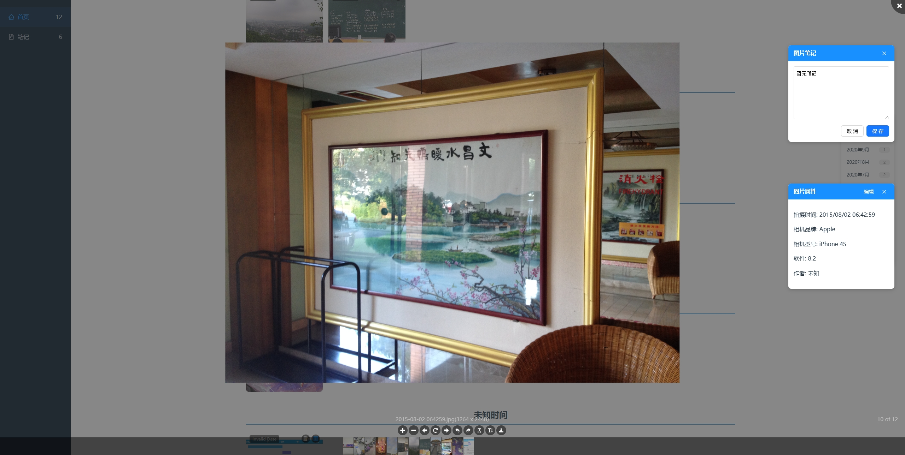
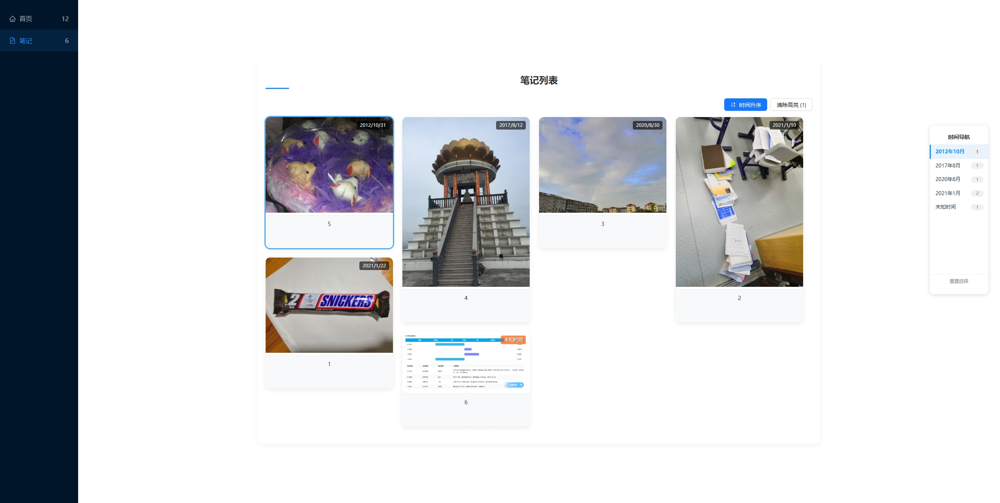

# 时间邮局 (Time Post Office)

这是一个基于React的Web应用，用于图片管理、照片管理，特别适合摄影爱好者和需要整理大量图片的用户。应用允许用户导入整个文件夹的图片，并提供图片属性编辑、笔记添加和时间线导航等功能。






## 功能特点

- **文件夹导入**：一次性导入整个文件夹中的所有图片
- **EXIF数据读取**：自动提取图片的EXIF元数据，包括相机型号、拍摄时间等
- **图片笔记**：为每张图片添加个性化笔记
- **属性编辑**：修改图片属性，如拍摄时间、相机型号、作者等
- **时间线导航**：通过时间线快速定位特定时期拍摄的照片
- **笔记视图**：专门查看已添加笔记的图片
- **配置导入/导出**：导出所有元数据设置，方便迁移或备份

## 技术栈

- **React 18**：用于构建用户界面
- **Styled Components**：组件样式管理
- **Ant Design**：UI组件库
- **IndexedDB**：本地存储图片元数据
- **react-viewer**：图片查看功能
- **react-draggable**：可拖动组件实现
- **exifr**：读取图片EXIF数据
- **Dayjs**：日期处理
- **Vite**：项目构建工具

## 如何使用

### 安装依赖

```bash
npm install
```

### 开发模式运行

```bash
npm run dev
```

### 构建项目

```bash
npm run build
```

### 预览构建结果

```bash
npm run preview
```

## 使用流程

1. **导入图片**：点击主页面的上传区域，选择包含图片的文件夹
2. **浏览图片**：导入后，图片将按照拍摄时间分组显示
3. **查看详情**：点击任意图片可在全屏模式下查看
4. **添加笔记**：在查看图片时，使用右侧笔记窗口添加备注
5. **编辑属性**：点击图片上的信息图标(ℹ️)可编辑图片属性
6. **时间导航**：使用右侧时间线导航到特定时间段的照片
7. **查看笔记**：通过侧边栏的"笔记"选项查看所有添加了笔记的图片

## 数据存储

应用使用浏览器的IndexedDB存储图片元数据，包括用户添加的笔记和修改的属性。原始图片文件不会上传到任何服务器，所有操作都在本地完成。

## 配置管理

- **导出配置**：将所有元数据导出为JSON文件
- **导入配置**：从之前导出的JSON文件恢复元数据配置

## 项目结构

- **components/**: 包含所有React组件
  - **ImageManager/**: 图片管理主视图
  - **NotesView/**: 笔记视图
  - **DraggableNoteWindow.jsx**: 可拖动笔记窗口
  - **DraggablePropertiesWindow.jsx**: 可拖动属性窗口
  - **EditDialog.jsx**: 编辑对话框
  - **TimelineSlider.jsx**: 时间线导航组件
  - **Sidebar.jsx**: 侧边栏导航
- **hooks/**: 自定义React Hooks
  - **useImageViewer.js**: 图片查看逻辑
- **utils/**: 工具函数
  - **imageDB.js**: IndexedDB操作函数

## 浏览器兼容性

应用使用了现代Web API和ES6+特性，建议在最新版本的Chrome、Firefox、Safari或Edge浏览器中使用。

## 许可

MIT License